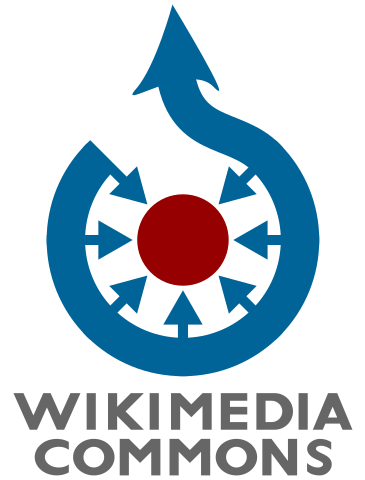
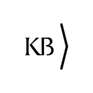

# Workshop OpenRefine & Wikimedia Commons

[OpenRefine](https://openrefine.org/) is a well-known tool for editing, enriching and manipulating data. It is widely used within the Wikimedia community to add data to Wikidata. As from version 3.7, you can also upload images to Wikimedia Commons, enriched with [structured data](https://commons.wikimedia.org/wiki/Commons:Structured_data).

## Learning objectives
In this workshop you will learn
 * how to use OpenRefine to upload new images with regular file descriptions (Wikitext) and structured data to Wikimedia Commons, and
 * how to add structured data to existing Commons files, using OpenRefine

## Target audience
This workshop is suitable for people who 
* have used OpenRefine before to add data to Wikidata, 
* know their way around OpenRefine v 3.4, 3.5 or 3.6, and 
* who know what "reconciling against Wikidata" means, 

but who *do not yet know* how to use OpenRefine to add images and structured data to Wikimedia Commons. 

This workshop is therefore **not suitable for** people who have never worked with OpenRefine and/or Wikidata.

 ## Required preparation
* Please bring your own laptop to this workshop.
* Make sure you know your way around OpenRefine v 3.4, 3.5 or 3.6, and are comfortable with reconciling and uploading data to Wikidata.
* Install OpenRefine 3.7 SNAPSHOT on your machine. It can be downloaded at https://github.com/OpenRefine/OpenRefine#snapshot-releases. Please note: 
   * this is an unstable release, functionalities can change from release to release and may or may not work, depending on the exact snapshot release you have installed. Don't be suprised if some things that worked yesterday and/or today will stop working tomorrow. Therefore, it might be possible that you **will not be able to upload your images** to Wikimedia Commons at all, depending the matureness of the snapshot releases. This workshop is more about learning the logic and required steps then it is about actually uploading the images.  
   * Version 3.6.2 (or older) is **not** suitable, because you cannot upload files to Wikimedia Commons with it.
* Download the [zipped OpenRefine-WikimediaCommons-Workshop repo](https://github.com/KBNLwikimedia/OpenRefine-WikimediaCommons-Workshop/archive/refs/heads/main.zip) and unzip it to some folder on your machine. This folder contains both your pre-built OpenRefine project archive (as tar.gz file) and your raw working materials: 18 local images, an Excel with data about the images, an OpenRefine schema and this explanation (README.md)
* If you have time: check out [OpenRefine 3.7+ – How to upload new files to Wikimedia Commons](https://docs.google.com/document/d/19eiMeq3XssiPrT9b04E-8XyE-desBEzYNgygLDYKP4o/edit)

## Working materials

### *1) OpenRefine*
* **OpenRefine 3.7 SNAPSHOT**: See instructions above.

* **URLs needed by OpenRefine 3.7+**:
For OpenRefine 3.7+ to be able to upload images to Commons, we will need to add a couple of URLs to it: 
  * *Wikidata reconciliation service* - to allow OpenRefine to reconcile local data against Wikidata
    * https://wikidata.reconci.link/en/api (English) 
    * https://wikidata.reconci.link/nl/api (Dutch) 
  * *Wikimedia Commons reconciliation service* - to allow OpenRefine to reconcile local file names against Wikimedia Commons File:-names 
    * https://commonsreconcile.toolforge.org/en/api (English) 
    * https://commonsreconcile.toolforge.org/nl/api (Dutch) 
  * *Wikimedia Commons manifest* - so OpenRefine knows that Wikimedia Commons is a special Wikbase instance it can talk/upload to.
    *  https://raw.githubusercontent.com/OpenRefine/wikibase-manifests/master/wikimedia-commons-manifest.json 

* **OpenRefine schema**: The OpenRefine schema that will be used to upload the images and data to Commons [can be found here](https://raw.githubusercontent.com/KBNLwikimedia/OpenRefine-WikimediaCommons-Workshop/main/schemaHavengezichtenGvN.json)

* **Pre-built OpenRefine project archive**: If you don't want to build the project in OpenRefine from scratch (see "Raw materials" below), you can download the [pre-built project archive](https://github.com/KBNLwikimedia/OpenRefine-WikimediaCommons-Workshop/blob/main/Dataset-WorkshopOpenRefine-WikiconNL19112022-xlsx.openrefine.tar.gz?raw=true) and import it into OpenRefine using the "Import project" dialog from the start screen. 

### *2) Raw materials*
If you want to build up the OpenRefine project from scratch, you can use these raw source materials

* **Online images**: We are going to upload the 18 images from *[Nederlandsche havengezichten enz.](http://resolver.kb.nl/resolve?urn=urn:gvn:KONB16:533939704)* to Commons. These images can be directly requested via http://resolver.kb.nl/resolve?urn=urn:gvn:KONB16:533939704&role=page&count=4&size=large *(count=1, count=2, count=3... count=18)*

* **Local images**: This page holds 18 individual images, which have been downloaded into the *[images](/images)* folder in this repo. These are only relevant if you want to upload these local images, rather then from the URLs.

* **Excel file**: All necessary data for our uploads to Commons is contained in [this Excel-file](Dataset_WorkshopOpenRefine_WikiconNL19112022.xlsx?raw=true). It will be used as input for creating our OpenRefine project during the workshop. 

  This Excel lets you choose if you want to upload the files (to Commons) from the local *[images](/images)* folder, or from the URLs above. 

### *3) Example outputs*
* **Commons category**: As a preparation for this workshop, a couple these images have already been uploaded to the Commons *[Category:Nederlandsche_havengezichten_enz.,_1780-1781_-_KONB16:533939704](https://commons.wikimedia.org/wiki/Category:Nederlandsche_havengezichten_enz.,_1780-1781_-_KONB16:533939704)*. These will be used for illustration and demo purposes. 

* **Example file**: One file within this category is *[File:De Haven van Amsterdam - Nederlandsche havengezichten enz. - KONB16-533939704 - Prent 3 van 18.jpg](https://commons.wikimedia.org/wiki/File:De_Haven_van_Amsterdam_-_Nederlandsche_havengezichten_enz._-_KONB16-533939704_-_Prent_3_van_18.jpg)*. We will use this example file for guidance, it holds  
  * Wikitext : based upon 
    * the [{{Artwork template}}](https://commons.wikimedia.org/wiki/Template:Artwork), 
    * the {{PD-art|PD-old-70-1923}} public domain template and 
    * the Category:Nederlandsche havengezichten enz., 1780-1781 - KONB16:533939704
  * Structured data : using [depicts (P180)](https://www.wikidata.org/wiki/Special:EntityPage/P180), [copyright status (P6216)](https://www.wikidata.org/wiki/Special:EntityPage/P6216), [source of file (P7482)](https://www.wikidata.org/wiki/Special:EntityPage/P7482) and [collection (P195)](https://www.wikidata.org/wiki/Special:EntityPage/P195) as a minimal set.  

### *4) Workshop guidance & outline*
* **PDF slides**: The outline, explanations, tips & tricks etc. that will be demonstrated during the workshop can be seen in [this PDF-presentation](add Commons URL PDF). You can also use it as guidance if you want to do this workshop by yourself. 

## Workshop leader
This workshop is given by [Olaf Janssen](https://www.wikidata.org/wiki/User:OlafJanssen), the Wikimedia coordinator of the [Koninklijke Bibliotheek](https://www.kb.nl/over-ons/experts/olaf-janssen), the national library of the Netherlands. In this role he stimulates and facilitates collaboration between the collections, knowledge, open data and staff of the KB on the one hand, and the projects of the Wikimedia movement, such as Wikipedia, Wikimedia Commons, Wikidata and Wikibase, on the other. He is also active as a volunteer within the community.

## Workshop instances
This workshop was given during
* [WikiconNL 2022](https://web.archive.org/web/20221014171306/https://www.wikimedia.nl/wikiconnl/), 19 november 2022, Utrecht, The Netherlands. See the [programme](https://web.archive.org/web/20221103154543/https://www.wikimedia.nl/programma-2022/) and the [session description](https://web.archive.org/web/20221110131459/https://www.wikimedia.nl/sessies2022/).

## Licensing
All workshop materials are released into the public domain under the [Creative Commons Zero v1.0 Universal](LICENSE) and can therefore be reused freely and openly. Attribution is not required, but still appreciated.

## Latest updates
This page was last updated on 11 November 2022.
